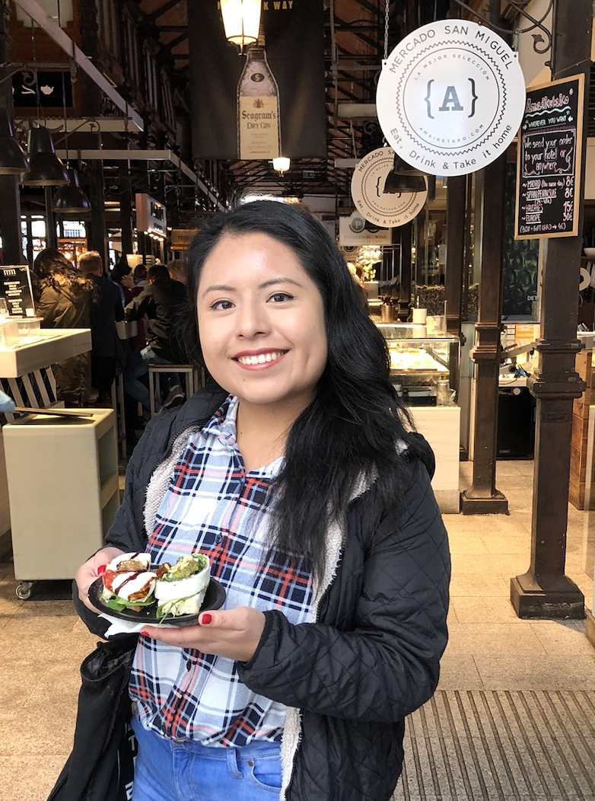

# Meet the TALI Team

### Kaitlin Hill
Kaitlin is a Senior at Oregon State University studying Computer Science and Education. She started learning Computer Science in college after enjoying some web development in high school. Her freshman year of programming was quite difficult as she had no previous programming experience. Her first year fueled her interest in Computer Science Education though. She believes that all students are capable of programming and should have the opportunity to learn programming before college. In her spare time, Kaitlin is involved with ACM-W and enjoys running.

### Sharlena Luyen
Sharlena studies Computer Science at Oregon State University. Once the lead of the team, she steps back in her final year in order to smoothly transition the team into continuous success. Her interest within the team revolves around helping and supporting the team!

 

### Aiden Nelson
Aiden is a 4th year student at Oregon State University. He currently studies Computer Science with a focus in Data Science. Aiden beleives that knowledge of Computer Science and programming can enable people to express their creativity and imagination in new and amazing ways. He is currently on track to continue his education into graduate school next fall. In his free time he enjoys cooking, playing board games, and making ceramic face mugs. 

### Jessica Garcia
Jessica is  a second year student studying Computer Science and Business at Oregon State University. Due to her curiosity and interest in exploring Computer Science outside of the classroom, she joined the team in hopes of engaging students to technology at a young age. Learning about Computer Science early on allows students to develop strong problem-solving skills which can be applied to their education and beyond. Jessica believes that through the team's mentorship, students will gain confidence in sharing and bringing their ideas to life. In her free time, Jessica enjoys hiking, exploring Oregon, and planning new adventures.

